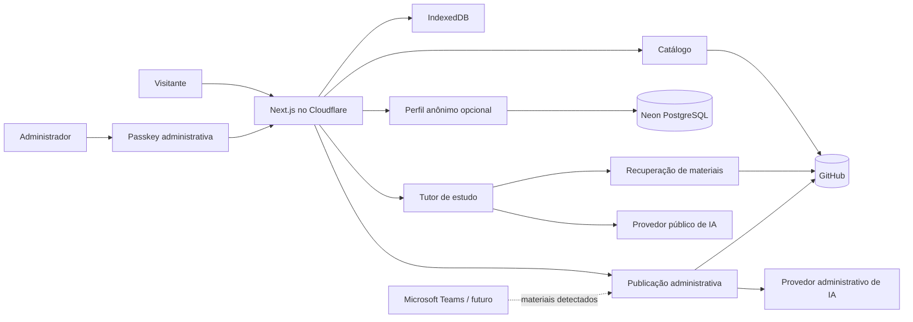

# DSM Atlas — Especificação de Produto e Arquitetura

**Status:** aprovado em 27 de setembro de 2026  
**Direção visual:** Atlas Guiado  
**Escopo:** planejamento, sem implementação

## 1. Objetivo

DSM Atlas transforma o repositório de estudos da Fatec em um catálogo público, uma área pessoal de estudo e um fluxo administrativo de publicação. O sistema preserva o GitHub como fonte de verdade dos materiais e atende dois usos com igual prioridade:

1. encontrar um conteúdo e continuar estudando rapidamente;
2. adicionar materiais baixados do Microsoft Teams, revisar sua organização e publicá-los diretamente no repositório.

O acervo atual possui três semestres (`DSM1`, `DSM2`, `DSM3`), dezoito disciplinas e formatos heterogêneos: documentos, apresentações, PDFs, imagens, arquivos compactados, código-fonte, bancos exportados, exercícios e projetos completos.

## 2. Escopo

### 2.1 Primeira entrega

- catálogo público por semestre, disciplina, assunto e material;
- busca textual e filtros;
- preview quando o navegador ou um renderizador seguro suportar o formato;
- download e abertura do arquivo original no GitHub;
- progresso, favoritos e último material acessado;
- uso imediato sem conta, persistido localmente;
- perfil anônimo opcional protegido por passkey para sincronização entre dispositivos;
- caderno do aluno com notas e flashcards escolhidos pelo usuário;
- tutor agentivo baseado nos materiais, com citações;
- upload administrativo em lote;
- classificação sugerida para todos os uploads, seguida de revisão humana;
- commit direto no GitHub após confirmação;
- limites rígidos de tamanho, requisições, tokens, ferramentas e orçamento.

### 2.2 Evoluções planejadas

- sincronização com canais e pastas do Microsoft Teams por Microsoft Graph;
- detecção de novos materiais do professor e fila de aprovação;
- refinamento dos provedores e modelos de IA para visitante e administrador;
- expansão para novos semestres sem alterar a arquitetura central.

### 2.3 Fora do escopo inicial

- contas tradicionais com senha, nome ou e-mail;
- rede social, ranking ou gamificação infantil;
- edição colaborativa dos materiais;
- publicação automática sem revisão administrativa;
- Git LFS ou object storage externo;
- agente público com permissão de alterar o repositório;
- busca vetorial obrigatória no primeiro corte;
- histórico integral de conversas sincronizado.

## 3. Princípios

1. **GitHub é a fonte de verdade.** O banco não duplica os arquivos acadêmicos.
2. **Anonimato por padrão.** Consultar e estudar não requer cadastro.
3. **Identidade progressiva.** A passkey anônima surge apenas quando o aluno deseja sincronização.
4. **Sugestão não é publicação.** Classificações e operações de IA passam por confirmação administrativa.
5. **Gratuidade antes de disponibilidade ilimitada.** Cotas se encerram sem gerar cobrança inesperada.
6. **Movimento orienta.** Animação explica posição e continuidade; não compete com o estudo.
7. **Portabilidade.** Provedores externos ficam atrás de interfaces pequenas.

## 4. Arquitetura escolhida

### 4.1 Stack

- **Linguagem:** TypeScript estrito.
- **Aplicação:** Next.js com App Router.
- **Runtime e assets:** Cloudflare Workers + Static Assets.
- **Banco:** Neon PostgreSQL serverless.
- **Autenticação:** Better Auth com WebAuthn/passkeys.
- **Fonte de materiais:** repositório GitHub atual.
- **Publicação:** GitHub REST/Git Data APIs com instalação de GitHub App de privilégio mínimo.
- **Estado local:** IndexedDB.
- **Validação:** schemas compartilhados nas bordas HTTP, integrações e respostas estruturadas de IA.
- **Estilo e movimento:** CSS moderno; Web Animations API para a animação cartográfica quando CSS não bastar. Nenhuma biblioteca geral de animação entra sem necessidade medida.

### 4.2 Topologia

### 4.3 Módulos e interfaces

#### Catálogo

Responsável por converter a árvore real do repositório em semestres, disciplinas, assuntos e materiais. Expõe operações de listagem, busca e resolução de um material. Detalhes da GitHub API ficam escondidos em um adapter.

#### Estudo

Responsável por progresso, favoritos, último acesso, notas e flashcards. Usa armazenamento local para visitantes sem perfil e sincronização com Neon após uma passkey anônima ser criada.

#### Identidade

Mantém duas classes explicitamente separadas:

- **Visitante:** sessão anônima local; passkey opcional sem nome/e-mail para sincronização.
- **Administrador:** identidade autorizada para upload e publicação; GitHub OAuth apenas para bootstrap e recuperação.

Uma identidade de visitante nunca pode receber privilégios administrativos.

#### Tutor

Expõe uma interface de conversa orientada ao estudo. Ferramentas permitidas:

- localizar materiais e trechos relevantes;
- explicar um conceito;
- comparar conteúdos selecionados;
- gerar perguntas, exercícios e feedback;
- criar ou editar notas e flashcards do próprio aluno, mediante ação explícita;
- montar um plano de estudo usando progresso e materiais selecionados.

Ferramentas proibidas:

- publicar, mover ou excluir arquivos;
- acessar segredos ou configuração administrativa;
- alterar cotas;
- operar sobre dados de outro perfil;
- responder como se tivesse consultado uma fonte que não recuperou.

#### Publicação

Recebe um lote, valida os arquivos, solicita sugestões de classificação, apresenta uma revisão editável e publica todos os itens aprovados em um único commit atômico. Conflitos de SHA, nomes repetidos e arquivos acima do limite retornam erros explícitos e recuperáveis.

#### Provedores de IA

Duas configurações sem compartilhamento de credenciais ou orçamento:

- **público:** tutor dos visitantes, cota patrocinada e BYOK opcional;
- **administrativo:** classificação de uploads e futura sincronização com Teams.

O primeiro adapter pode mudar sem alterar as interfaces do Tutor ou da Publicação.

## 5. Experiência do usuário

### 5.1 Navegação principal

1. **Atlas:** mapa do semestre atual e botão para alternar para lista.
2. **Disciplina:** visão dos assuntos, progresso e materiais recentes.
3. **Material:** preview, metadados, download, progresso e abertura do tutor.
4. **Tutor:** conversa com painel de fontes e ações para salvar nota ou flashcard.
5. **Caderno:** notas e flashcards salvos, organizados por disciplina/material.
6. **Administração:** upload, revisão, publicação e histórico de commits criados pelo portal.

### 5.2 Fluxo sem conta

1. O visitante abre qualquer material sem barreira.
2. Progresso, favoritos, notas e flashcards são gravados no IndexedDB.
3. O portal oferece passkey somente ao explicar o benefício de sincronização.
4. Ao aceitar, cria-se um identificador pseudônimo e os dados locais são mesclados com o perfil remoto.
5. Nenhum nome ou e-mail é solicitado.

### 5.3 Fluxo de upload

1. O administrador entra com passkey.
2. Arrasta um ou mais arquivos baixados do Teams.
3. O sistema rejeita antecipadamente tipos perigosos ou tamanho acima do limite configurado.
4. O classificador administrativo sugere semestre, disciplina, pasta, tipo e título para cada item.
5. A interface exibe confiança, justificativa curta e prévia do caminho final.
6. O administrador corrige ou confirma cada sugestão.
7. Uma tela final mostra o diff lógico do lote.
8. Um único commit é criado na branch principal.
9. O catálogo invalida o cache e exibe os novos materiais.

A futura integração com Teams começa na etapa 3: ela alimentará a mesma fila de revisão, sem criar um segundo fluxo de publicação.

## 6. Direção visual: Atlas Guiado

### 6.1 Conceito

O curso é representado como um mapa legível:

- semestre é o território selecionado;
- disciplina é uma linha nomeada;
- material é uma estação;
- progresso é o trecho percorrido;
- “Você está aqui” identifica o ponto de retomada;
- novo material aparece como uma entrada a revisar, não como conteúdo já publicado.

A metáfora sempre acompanha rótulos textuais. O mapa nunca é a única forma de navegar: uma lista semanticamente equivalente permanece disponível.

### 6.2 Linguagem

- papel técnico claro como superfície;
- grade cartográfica discreta;
- tinta quase preta;
- azul para o semestre/rota ativa;
- verde-lima para progresso e retomada;
- coral para entrada recente ou ação que exige atenção;
- tipografia grotesca de alta legibilidade com títulos compactos e utilitários precisos;
- controles retos ou com raio contido, sem cards genéricos em excesso;
- nada que pareça dashboard corporativo ou aplicativo escolar infantil.

### 6.3 Movimento

- uma animação principal desenha as rotas na primeira entrada;
- transições espaciais preservam contexto entre semestre, disciplina e material;
- hover/foco amplia discretamente uma estação e revela seu rótulo;
- ações de upload e commit usam progressão sequencial clara;
- não existem partículas decorativas ou movimento ambiente contínuo;
- `prefers-reduced-motion` remove desenho de rotas e deslocamentos, mantendo feedback instantâneo.

## 7. Modelo de dados

### 7.1 Dados derivados do GitHub

- `Semester`: código, nome e ordem;
- `Discipline`: código, nome, semestre e caminho;
- `Material`: caminho, nome, extensão, tamanho, SHA, URL, tipo inferido e data conhecida;
- `CatalogSnapshot`: commit SHA indexado e momento da atualização.

Esses dados podem ser cacheados para busca, mas o GitHub permanece autoritativo.

### 7.2 Dados persistidos no Neon

- `AnonymousUser`: identificador opaco e timestamps;
- tabelas exigidas pelo Better Auth para credenciais e sessões;
- `StudyProgress`: material, estado e último acesso;
- `Favorite`: usuário e material;
- `Note`: texto escolhido pelo usuário e referência opcional ao material/trecho;
- `Flashcard`: frente, verso, disciplina, material e estado de revisão;
- `AiUsageLedger`: escopo público/administrativo, sujeito pseudônimo, janela, requisições e tokens;
- `UploadBatch`: estado, arquivos propostos, classificação e resultado do commit;
- `AdminIdentity`: vínculo administrativo e permissões.

O histórico integral do tutor não é sincronizado. Conversas ficam no dispositivo; somente notas, flashcards e resumos explicitamente salvos atravessam dispositivos.

## 8. IA e controle de custos

### 8.1 Tutor público

O tutor recupera somente materiais selecionados ou relacionados à disciplina atual. Cada resposta factual sobre o conteúdo apresenta referência ao arquivo e, quando disponível, página, linha ou trecho. Quando não houver evidência suficiente, informa a limitação em vez de completar por suposição.

A execução possui limites simultâneos:

- requisições por minuto por IP e identificador de dispositivo;
- requisições e tokens por dia por dispositivo ou perfil;
- tamanho máximo da mensagem e dos anexos;
- tokens máximos por conversa e resposta;
- quantidade máxima de ações de ferramenta por turno;
- tempo máximo de execução;
- teto global diário e mensal do provedor público;
- circuit breaker que encerra a cota patrocinada antes de qualquer cobrança.

Após o limite patrocinado, o visitante pode aguardar a renovação ou usar BYOK. A chave BYOK permanece em memória/sessão do navegador, nunca é registrada, sincronizada ou enviada a logs do DSM Atlas. A viabilidade de chamada direta depende do provedor escolhido; caso exija proxy, o produto explicará que a chave transita pelo Worker sem persistência.

### 8.2 IA administrativa

Usa credencial, endpoint, limites e telemetria separados. Sua saída é validada contra schema e nunca publica sem revisão. O provedor será decidido antes da implementação dessa fase.

### 8.3 Classificação

A saída mínima contém:

- semestre sugerido;
- disciplina sugerida;
- caminho relativo sugerido;
- título normalizado;
- tipo de material;
- confiança por campo;
- aviso quando o arquivo não pôde ser lido.

A aplicação valida valores contra os semestres e disciplinas existentes. A IA não pode inventar um destino silenciosamente.

## 9. Segurança e privacidade

- WebAuthn/passkeys como autenticação principal.
- GitHub OAuth restrito ao administrador e usado apenas para bootstrap/recuperação.
- GitHub App com permissões mínimas e segredo somente no servidor.
- cookies `HttpOnly`, `Secure`, `SameSite=Lax` ou mais restritivo quando compatível;
- proteção CSRF e allowlist explícita de origens;
- rate limit persistente nos endpoints sensíveis;
- Turnstile no início de uso patrocinado da IA quando o risco justificar o atrito;
- validação de nome, extensão, MIME, tamanho e caminho dos uploads;
- rejeição de path traversal, executáveis e arquivos com nomes conflitantes;
- sanitização de conteúdo renderizado e isolamento de previews;
- respostas de IA e materiais externos tratados como dados não confiáveis;
- nenhum segredo em código, banco de cliente, logs ou mensagens de erro;
- dados pseudônimos mínimos e possibilidade de excluir o perfil anônimo.

## 10. Falhas e recuperação

- **GitHub indisponível:** catálogo cacheado continua legível; publicação fica bloqueada e o lote permanece em rascunho.
- **Conflito de commit:** atualizar o SHA base, recalcular a prévia e exigir nova confirmação.
- **Neon indisponível:** visitantes sem perfil continuam com estado local; sincronização mostra estado pendente sem descartar alterações.
- **IA indisponível ou sem cota:** estudo tradicional permanece funcional; nenhuma classificação administrativa é publicada automaticamente.
- **Arquivo sem preview:** oferecer metadados, download e abertura no GitHub.
- **Passkey perdida:** visitante sem dado pessoal não é recuperável sem outra passkey sincronizada; administrador recupera via GitHub autorizado.
- **Mesclagem local/remota:** usar timestamps por registro e tornar conflitos de notas visíveis; nunca apagar silenciosamente conteúdo do aluno.

## 11. Busca e recuperação de conteúdo

O primeiro corte usa índice textual derivado de nomes, caminhos e texto extraível. PDFs e documentos entram no índice somente quando a extração for segura e reprodutível. Busca vetorial fica adiada até que consultas reais demonstrem necessidade.

Para o tutor, os trechos recuperados carregam referência estável ao commit e ao arquivo. Um material alterado invalida apenas seus trechos derivados.

## 12. Verificação

### 12.1 Fluxos críticos

- visitante abre o Atlas, encontra uma disciplina e retoma um material;
- progresso local funciona sem rede e sincroniza após criação de passkey;
- exclusão do perfil remove dados remotos sem afetar os materiais públicos;
- tutor responde com fonte e recusa afirmação sem evidência;
- limites individuais e globais interrompem chamadas antes do provedor faturável;
- BYOK não aparece no banco, logs ou respostas;
- identidade de visitante não alcança endpoints administrativos;
- upload válido produz exatamente um commit com caminhos confirmados;
- conflito de SHA não sobrescreve alteração remota;
- falha durante o lote não resulta em publicação parcial.

### 12.2 Qualidade visual

- comparar desktop e mobile com o comp aprovado do Atlas Guiado;
- validar navegação completa por teclado e foco visível;
- validar contraste e zoom de texto;
- confirmar experiência equivalente na visualização em lista;
- confirmar `prefers-reduced-motion`;
- medir carregamento do catálogo e ausência de animação custosa durante leitura.

## 13. Sequência de entregas

1. fundação visual e catálogo público;
2. estado de estudo local;
3. perfil anônimo com passkey e sincronização;
4. upload administrativo e publicação no GitHub;
5. tutor com fontes, caderno e cotas rígidas;
6. classificação administrativa por IA;
7. sincronização com Microsoft Teams usando a fila de revisão existente.

Cada etapa termina utilizável. A IA pública não bloqueia catálogo, busca, leitura, downloads ou progresso.

## 14. Riscos aceitos

- planos gratuitos e seus limites podem mudar; adaptadores e tetos evitam dependência irreversível;
- 0,5 GB no Neon é suficiente apenas porque os materiais permanecem no GitHub;
- passkey anônima sem outro dispositivo não oferece recuperação de dados pessoais;
- arquivos GitHub acima do limite configurado precisarão ser reduzidos ou ficar fora do fluxo;
- BYOK tem diferenças de CORS e segurança entre provedores, exigindo validação na escolha do provedor;
- a gratuidade do tutor implica indisponibilidade controlada quando a cota patrocinada termina.

## 15. Decisões ainda adiadas

Estas decisões pertencem às respectivas fases e não impedem o desenho atual:

- provedor e modelo da IA pública;
- provedor e modelo da IA administrativa;
- valores numéricos das cotas após medir custo por sessão;
- tamanho máximo de upload conforme limites reais do runtime e GitHub;
- detalhes de permissões e estrutura do Microsoft Graph;
- necessidade futura de busca vetorial.

Nenhuma dessas decisões pode eliminar os tetos globais, misturar credenciais pública/administrativa ou conceder escrita ao tutor dos visitantes.
